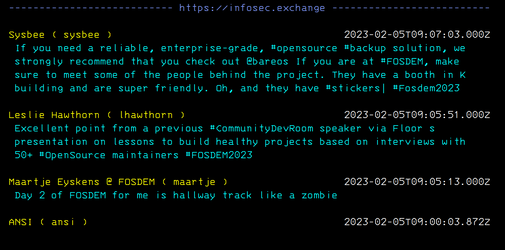
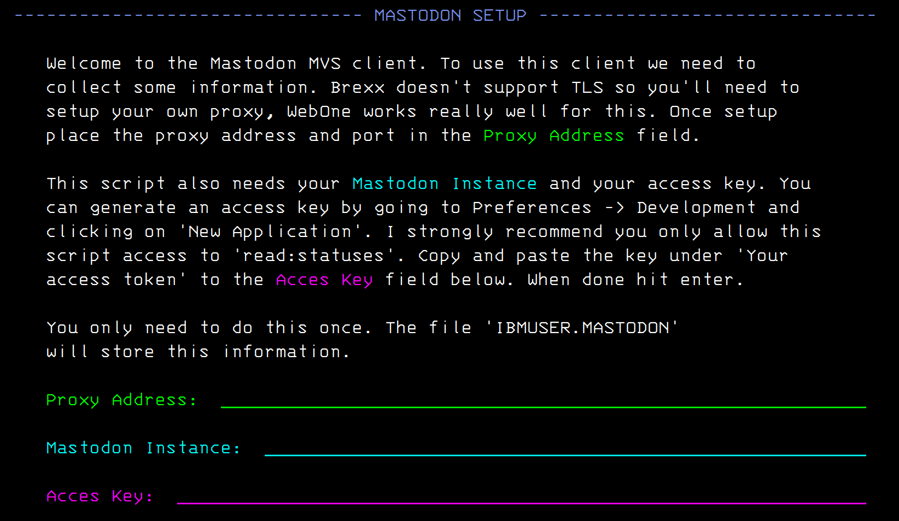

# BREXXTODON

:warning: **This is an alpha release, mostly a POC, there are bugs, it abends, it S0C4s and S0C1, use at your own risk** :warning:

With BREXX available on MVS 3.8J I wanted to try and make something fun
that would use full screen display and TCP/IP, so why not a Mastodon
client!

Let me tell you, REXX and JSON don't really mix, but we were able to do
it (barely). 

## Install

Copy the rexx script `mastodon.rexx` to anywhere on your MVS 3.8j system,
making sure you have the latest version of BREXX installed available
https://github.com/mvslovers/brexx370.

You'll also need an SSL stripping proxy. WebOne works really well and is
availble here: https://github.com/atauenis/webone. Just make sure you
edit the `webone.conf` file and add your mastodon instance to the
`[ForceHttps]` section. 

With that all setup you can launch the script and it will prompt you 
for the information it needs

## Known bugs

* Boosted toots sometimes mess up the name of the person who boosted the toot if the preceding toot was an image only post
* Abends/BREXX Error messages occur on MVS/CE
* Sometimes crashes on initial load
* You can only view toots once then the app quits